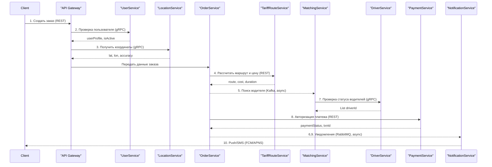
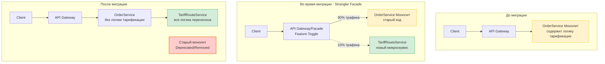

# План миграции монолита на микросервисы (на примере Яндекс.Такси)

## Введение
Данный план иллюстрирует пошаговую декомпозицию крупной информационной системы (на примере Яндекс.Такси) с разделением монолита на микросервисы, анализом бизнес-процесса оформления заказа, схемами взаимодействия, внедрением паттерна Strangler и экспертной оценкой результата.

---

## 0. Описание системы и бизнес-процессов
**Назначение Яндекс.Такси:**
Платформа для заказа такси, построения маршрутов, расчета стоимости, подбора водителя, проведения оплаты и отправки уведомлений.
**Ключевой процесс — оформление заказа:**

1. Пользователь создает заказ (координаты и тариф).

2. Проверяется актуальность и статус пользователя.

3. Получаются координаты пользователя.

4. Строится оптимальный маршрут, оценивается цена.

5. Подбирается подходящий водитель.

6. Производится авторизация и проведение платежа.

7. Отправляются push/SMS-уведомления обеим сторонам.

---

## 1. Определение микросервисов

| Микросервис         | Назначение                                   | Хранилище            |
| ------------------- | -------------------------------------------- | -------------------- |
| UserService         | Профили и аутентификация пользователя        | PostgreSQL           |
| DriverService       | Профили и статус водителей                   | PostgreSQL           |
| OrderService        | Управление заказами и их статусами           | PostgreSQL + MongoDB |
| TariffRouteService  | Построение маршрута и расчет тарифа          | Redis + PostgreSQL   |
| PaymentService      | Проведение и учёт платежей                   | PostgreSQL           |
| NotificationService | Отправка уведомлений по каналам              | MongoDB              |
| LocationService     | Real-time геолокация пользователей/водителей | Redis + TimescaleDB  |
| MatchingService     | Подбор оптимального водителя по заказу       | Redis                |

---

## 2. Сценарий взаимодействия микросервисов

### Детальная таблица взаимодействия

| Шаг  | Инициатор             | Получатель             | Описание действия                           | Способ взаимодействия      | Передаваемые данные                                     | Ожидаемый ответ                   |
|------|-----------------------|------------------------|---------------------------------------------|----------------------------|---------------------------------------------------------|------------------------------------|
| 1    | Клиентское приложение | API Gateway            | Запрос на создание заказа                   | Синхронный (REST/HTTP)     | userId, pickupLocation, dropoffLocation, tariffType     | orderId, status, estimatedCost     |
| 2    | API Gateway           | UserService            | Проверка аутентификации и статуса           | Синхронный (gRPC)          | userId, authToken                                       | userProfile, isActive              |
| 3    | API Gateway           | LocationService        | Получение текущих координат                 | Синхронный (gRPC)          | userId                                                  | latitude, longitude, accuracy      |
| 4    | OrderService          | TariffRouteService     | Запрос расчета маршрута и стоимости         | Синхронный (REST/HTTP)     | pickupCoords, dropoffCoords, tariffType                 | route, distance, duration, cost    |
| 5    | OrderService          | MatchingService        | Поиск доступного водителя                   | Асинхронный (Kafka)        | orderId, location, tariffType                           | Асинхронное подтверждение          |
| 6    | OrderService          | NotificationService    | Уведомление о создании заказа               | Асинхронный (RabbitMQ)     | orderId, userId, status                                 | Асинхронное подтверждение          |
| 7    | MatchingService       | DriverService          | Проверка статуса и геолокации водителей     | Синхронный (gRPC)          | location, radius, tariffType                            | List<driverId>, availability       |
| 8    | OrderService          | PaymentService         | Предварительная авторизация платежа         | Синхронный (REST/HTTP)     | orderId, userId, amount                                 | paymentStatus, transactionId       |
| 9    | OrderService          | NotificationService    | Уведомление о назначении водителя           | Асинхронный (RabbitMQ)     | orderId, driverId, userId, ETA                          | Асинхронное подтверждение          |
| 10   | NotificationService   | Пользователь/Водитель  | Доставка Push/SMS уведомлений               | Асинхронный (FCM/APNS)     | message, deviceToken                                    | deliveryStatus                     |

### Последовательность вызовов в процессе создания заказа (Mermaid диаграмма):


**Обозначения:**

- 🔵 Сплошные стрелки (`->>`, `-->>`) — синхронные вызовы (REST, gRPC)

- 🟠 Пунктирные стрелки (`-->>`) с async — асинхронные (Kafka, RabbitMQ)

---

## 3. Применение паттерна Strangler (OrderService → TariffRouteService)

### 3.1. Описание паттерна Strangler
Паттерн Strangler (Удушение) позволяет постепенно заменять функциональность монолита новыми микросервисами без остановки системы. Основная идея — создать фасад (API Gateway), который маршрутизирует запросы либо в старый монолит, либо в новый микросервис на основе Feature Toggle.

### 3.2. Этапы миграции

| Фаза | Действие                                        | Результат                                                | Срок     |
| ---- | ----------------------------------------------- | -------------------------------------------------------- | -------- |
| 1    | Анализ и планирование                           | Выделены функции: расчет маршрута, расчет стоимости      | 1 неделя |
| 1    | Анализ зависимостей в монолите                  | Определены связи с OrderService, LocationService         | 1 неделя |
| 1    | Определение границ нового микросервиса          | Определен API контракт нового сервиса                    | 1 неделя |
| 2    | Разработка прокси-слоя (Strangler Facade)       | API Gateway направляет запросы в монолит или микросервис | 2 недели |
| 2    | Настройка маршрутизации запросов                | Правила маршрутизации на основе Feature Flag             | 1 неделя |
| 2    | Реализация Feature Toggle для переключения      | Возможность переключения без простоя                     | 1 неделя |
| 3    | Разработка TariffRouteService (расчет маршрута) | Новый сервис расчета оптимального маршрута               | 3 недели |
| 3    | Разработка функционала тарификации              | Интеграция с тарифной сеткой                             | 2 недели |
| 3    | Миграция данных о тарифах                       | Данные перенесены в PostgreSQL + Redis кэш               | 1 неделя |
| 4    | Параллельная работа старого и нового кода       | 10% трафика на новый сервис, остальное - монолит         | 2 недели |
| 4    | A/B тестирование и мониторинг                   | Сравнение метрик производительности                      | 1 неделя |
| 5    | Постепенное удаление кода из монолита           | Код расчета маршрута удален из OrderService              | 1 неделя |
| 5    | Полное переключение на микросервис              | 100% трафика обрабатывает TariffRouteService             | 1 неделя |

### 3.3. Архитектурная диаграмма применения Strangler Pattern (Mermaid)



### 3.4. Ключевые фрагменты реализации

#### 3.4.1. API Gateway с Feature Toggle (C# .NET)

```csharp
// API Gateway с Feature Toggle для Strangler Pattern
// Фрагмент класса TariffRouteFacade
public class TariffRouteFacade
{
    private readonly IMonolithOrderService _monolithService;
    private readonly ITariffRouteService _newMicroservice;
    private readonly IFeatureToggle _featureToggle;
    private readonly ILogger<TariffRouteFacade> _logger;
    public async Task<TariffCalculationResponse> CalculateRouteAndPrice(
        TariffCalculationRequest request)
    {
        try
        {
            // Feature Toggle определяет, какой сервис использовать
            bool useNewService = await _featureToggle
                .IsEnabledAsync("UseTariffRouteMicroservice", request.UserId);
            if (useNewService)
            {
                _logger.LogInformation(
                    "Routing to new TariffRouteService for user {UserId}",
                    request.UserId);
                return await _newMicroservice.CalculateRouteAndPriceAsync(request);
            }
            else
            {
                _logger.LogInformation(
                    "Routing to monolith OrderService for user {UserId}",
                    request.UserId);
                return await _monolithService.CalculateRouteAndPriceAsync(request);
            }
        }
        catch (Exception ex)
        {
            _logger.LogError(ex, "Error calculating route and price");
            // Fallback на монолит в случае ошибки нового сервиса
            if (useNewService)
            {
                _logger.LogWarning("Falling back to monolith");
                return await _monolithService.CalculateRouteAndPriceAsync(request);
            }
            throw;
        }
    }
}
// Конфигурация Feature Toggle
public class FeatureToggleConfig
{
    public bool Enabled { get; set; }
    public int PercentageRollout { get; set; } // 0-100
    public List<string> WhitelistedUserIds { get; set; }
}

```
**Комментарии к реализации:**

- `Feature Toggle` позволяет динамически переключать трафик между монолитом и новым сервисом

- `PercentageRollout` обеспечивает постепенное увеличение нагрузки (канареечное развертывание)

- `Fallback` механизм гарантирует отказоустойчивость при сбоях нового сервиса

- Логирование обеспечивает прозрачность маршрутизации для мониторинга

#### 3.4.2. Новый микросервис TariffRouteService (C# .NET Core)

```csharp
// TariffRouteService - новый микросервис
// Контроллер для расчета маршрута и тарифа
[ApiController]
[Route("api/v1/tariff-route")]
public class TariffRouteController : ControllerBase
{
    private readonly ITariffCalculator _tariffCalculator;
    private readonly IRouteOptimizer _routeOptimizer;
    private readonly IDistributedCache _cache;
    [HttpPost("calculate")]
    public async Task<ActionResult<TariffCalculationResponse>> Calculate(
        [FromBody] TariffCalculationRequest request)
    {
        var cacheKey = $"route:{request.PickupLocation}:{request.DropoffLocation}";
        // 1. Проверка кэша для популярных маршрутов
        var cachedResult = await _cache.GetStringAsync(cacheKey);
        if (cachedResult != null)
        {
            return JsonSerializer.Deserialize<TariffCalculationResponse>(cachedResult);
        }
        // 2. Расчет оптимального маршрута
        var route = await _routeOptimizer.CalculateOptimalRoute(
            request.PickupLocation,
            request.DropoffLocation
        );
        // 3. Расчет стоимости на основе тарифа
        var price = await _tariffCalculator.CalculatePrice(
            route.Distance,
            route.EstimatedDuration,
            request.TariffType,
            DateTime.Now // учет динамического ценообразования (час пик)
        );
        var response = new TariffCalculationResponse
        {
            Route = route,
            Price = price,
            EstimatedDuration = route.EstimatedDuration,
            Distance = route.Distance
        };
        // 4. Сохранение результата в кэш (15 минут)
        await _cache.SetStringAsync(
            cacheKey,
            JsonSerializer.Serialize(response),
            new DistributedCacheEntryOptions
            {
                AbsoluteExpirationRelativeToNow = TimeSpan.FromMinutes(15)
            }
        );
        return Ok(response);
    }
}
// Модели данных
public class TariffCalculationRequest
{
    public string UserId { get; set; }
    public GeoCoordinate PickupLocation { get; set; }
    public GeoCoordinate DropoffLocation { get; set; }
    public TariffType TariffType { get; set; }
}
public class TariffCalculationResponse
{
    public RouteInfo Route { get; set; }
    public decimal Price { get; set; }
    public TimeSpan EstimatedDuration { get; set; }
    public double Distance { get; set; }
}

```
**Комментарии к реализации:**

- Использование `Redis` для кэширования популярных маршрутов снижает нагрузку

- Разделение ответственности между `RouteOptimizer` и `TariffCalculator` обеспечивает гибкость

- Учет динамического ценообразования (час пик, спрос) в `TariffCalculator`

- RESTful API упрощает интеграцию с другими микросервисами

### 3.5. Документация API (OpenAPI/Swagger спецификация)

```yaml
openapi: 3.0.0
info:
  title: TariffRouteService API
  version: 1.0.0
  description: Микросервис для расчета маршрута и стоимости поездки
servers:

  - url: https://api.yandex-taxi.ru/tariff-route/v1
    description: Production server
paths:
  /calculate:
    post:
      summary: Расчет маршрута и стоимости поездки
      operationId: calculateRouteAndPrice
      tags:

        - Tariff Calculation
      requestBody:
        required: true
        content:
          application/json:
            schema:
              $ref: '#/components/schemas/TariffCalculationRequest'
            example:
              userId: "user123"
              pickupLocation:
                latitude: 55.751244
                longitude: 37.618423
              dropoffLocation:
                latitude: 55.755826
                longitude: 37.617300
              tariffType: "Economy"
      responses:
        '200':
          description: Успешный расчет маршрута и стоимости
          content:
            application/json:
              schema:
                $ref: '#/components/schemas/TariffCalculationResponse'
              example:
                route:
                  points:

                    - { latitude: 55.751244, longitude: 37.618423 }

                    - { latitude: 55.755826, longitude: 37.617300 }
                  distance: 8.5
                  estimatedDuration: "PT15M"
                price: 450.50
                estimatedDuration: "PT15M"
                distance: 8.5
        '400':
          description: Неверные входные данные
          content:
            application/json:
              schema:
                type: object
                properties:
                  error:
                    type: string
                    example: "Invalid coordinates"
        '500':
          description: Внутренняя ошибка сервера
components:
  schemas:
    TariffCalculationRequest:
      type: object
      required:

        - userId

        - pickupLocation

        - dropoffLocation

        - tariffType
      properties:
        userId:
          type: string
          example: "user123"
        pickupLocation:
          $ref: '#/components/schemas/GeoCoordinate'
        dropoffLocation:
          $ref: '#/components/schemas/GeoCoordinate'
        tariffType:
          type: string
          enum: [Economy, Comfort, Business, Premium]
          example: "Economy"
    TariffCalculationResponse:
      type: object
      properties:
        route:
          $ref: '#/components/schemas/RouteInfo'
        price:
          type: number
          format: decimal
          example: 450.50
        estimatedDuration:
          type: string
          format: duration
          example: "PT15M"
        distance:
          type: number
          format: double
          example: 8.5
    GeoCoordinate:
      type: object
      required:

        - latitude

        - longitude
      properties:
        latitude:
          type: number
          format: double
          minimum: -90
          maximum: 90
          example: 55.751244
        longitude:
          type: number
          format: double
          minimum: -180
          maximum: 180
          example: 37.618423
    RouteInfo:
      type: object
      properties:
        points:
          type: array
          items:
            $ref: '#/components/schemas/GeoCoordinate'
        distance:
          type: number
          format: double
          description: Расстояние в километрах
        estimatedDuration:
          type: string
          format: duration
          description: Оценочное время в формате ISO 8601

```
**Ключевые особенности API:**

- Строгая типизация через OpenAPI схему обеспечивает контрактное взаимодействие

- Примеры запросов/ответов упрощают интеграцию

- Валидация координат (широта: -90..90, долгота: -180..180)

- Использование ISO 8601 для временных интервалов (PT15M = 15 минут)

---

## 4. Экспертная оценка эффективности применения паттерна Strangler

### 4.1. Сравнительная таблица подходов к миграции

| Критерий оценки                 | Монолит (до)                | Big Bang миграция             | Strangler Pattern                     | Оценка (1-10)                                |
| ------------------------------- | --------------------------- | ----------------------------- | ------------------------------------- | -------------------------------------------- |
| **Риски миграции**              | Низкие (стабильная система) | Очень высокие                 | Низкие (постепенная миграция)         | 9/10 - минимальные риски                     |
| **Время простоя системы**       | Нет (существующая система)  | Значительное (дни/недели)     | Отсутствует (непрерывная работа)      | 10/10 - zero downtime                        |
| **Сложность внедрения**         | Низкая (уже реализовано)    | Очень высокая                 | Средняя (требует фасада)              | 7/10 - требует дополнительной инфраструктуры |
| **Возможность отката**          | Не требуется                | Практически невозможен        | Простой (переключение флага)          | 10/10 - мгновенный откат                     |
| **Стоимость реализации**        | Низкая (поддержка)          | Очень высокая                 | Средняя (инкрементальная)             | 8/10 - распределена во времени               |
| **Скорость доставки новых фич** | Низкая (долгие релизы)      | Блокировка на время миграции  | Постепенное улучшение                 | 8/10 - не блокирует разработку               |
| **Масштабируемость**            | Ограниченная (вертикальная) | Высокая после миграции        | Высокая (независимое масштабирование) | 10/10 - полная независимость                 |
| **Производительность**          | Средняя (узкие места)       | Неизвестная (риск деградации) | Постепенное улучшение                 | 9/10 - контролируемое улучшение              |
| **Качество кода**               | Низкое (технический долг)   | Высокое после миграции        | Постепенное улучшение                 | 9/10 - рефакторинг малыми шагами             |
| **Удобство тестирования**       | Сложное (тесная связность)  | Сложное (всё сразу)           | Упрощается со временем                | 9/10 - изолированное тестирование            |

### 4.2. Преимущества паттерна Strangler

1. **Минимизация рисков**: Постепенная миграция позволяет выявлять проблемы на ранних стадиях

2. **Zero downtime**: Система продолжает работать во время всего процесса миграции

3. **Быстрый откат**: Feature Toggle позволяет мгновенно вернуться к старой реализации

4. **Контролируемая нагрузка**: Канареечное развертывание (10% → 50% → 100%) снижает риски

5. **Параллельная разработка**: Команды могут работать над новыми фичами параллельно с миграцией

6. **A/B тестирование**: Возможность сравнения производительности старой и новой версий

### 4.3. Недостатки и риски

1. **Дополнительная сложность инфраструктуры**: Требуется внедрение API Gateway и Feature Toggle

2. **Временные издержки на поддержку двух версий**: Параллельная работа монолита и микросервиса

3. **Риск утечки абстракций**: Неправильное выделение границ сервиса может привести к связности

4. **Необходимость мониторинга**: Требуется тщательное отслеживание метрик обеих версий

### 4.4. Рекомендации по применению
**Когда использовать Strangler Pattern:**

- Большой монолит с высокой нагрузкой

- Критичность непрерывной работы системы (финтех, такси, медицина)

- Необходимость постепенного улучшения производительности

- Наличие ресурсов для A/B тестирования и мониторинга
**Когда НЕ использовать:**

- Небольшие системы с низкой нагрузкой (овердизайн)

- Полная переработка бизнес-логики (проще переписать заново)

- Отсутствие инфраструктуры для Feature Toggle и мониторинга

---

## 5. Выводы
Паттерн Strangler представляет собой оптимальную стратегию для поэтапной миграции функционала из монолита в микросервисную архитектуру. На примере выделения TariffRouteService из OrderService в системе Яндекс.Такси продемонстрированы следующие преимущества:

1. **Безопасность**: Минимизация рисков благодаря постепенному переходу и возможности быстрого отката

2. **Непрерывность бизнеса**: Отсутствие простоя системы во время миграции (zero downtime)

3. **Контролируемость**: A/B тестирование и мониторинг позволяют сравнивать производительность

4. **Гибкость**: Feature Toggle обеспечивает динамическое управление трафиком

5. **Эволюционность**: Постепенное улучшение качества кода и архитектуры
Экспертная оценка показывает высокие баллы (8-10/10) по всем ключевым критериям, что подтверждает эффективность данного подхода для крупных распределенных систем.
**Итоговая рекомендация:**
Паттерн Strangler следует применять для миграции функциональных блоков с четкими границами, высокой нагрузкой и требованиями к непрерывной работе. Успешная реализация требует инвестиций в инфраструктуру (API Gateway, Feature Toggle, мониторинг), но окупается снижением рисков и плавным переходом к микросервисной архитектуре.

---
